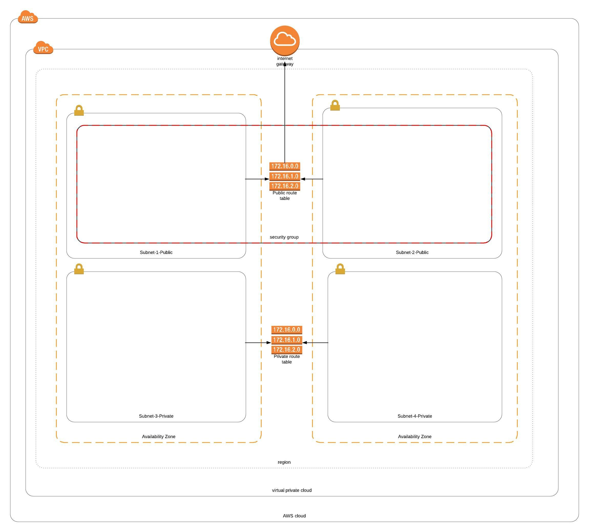

# Deploying Network Components in AWS using Terraform

In this example we will deploy only a Network infrastructire in AWS. We will deploy the following using the terraform script: 

1. VPC (Virtual Private Cloud)
2. Internet Gateway 
3. Route Tables - We will create two Route tables. one for public and the other for private network 
4. Subnets - We will create 4 subnets. 2 Private and 2 Public. And we will create each of the subnets in seperate Availability zones. 
5. Security Groups - We will create 3 security groups
6. NACL - We will create one Network Access Control List. 

The Terraform script used here is named as aws_network.tf. 

